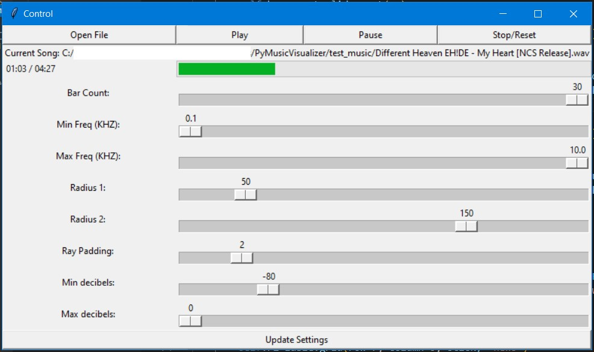
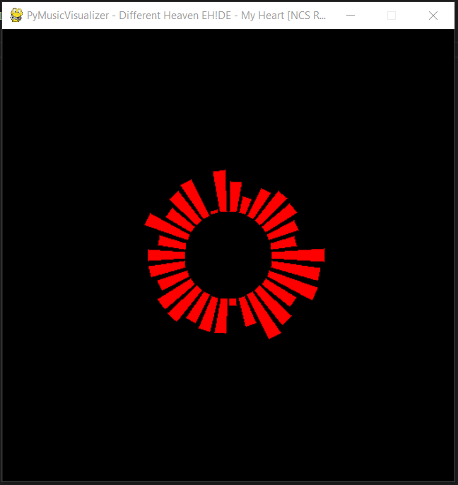

# Python-Music-Visualizer
## Purpose
- I wanted to create a Python music visualizer that would play music and render the visualization live.
- The control window was added, to make it easier to play around with various aspects of the visualizer on the fly.

## Example images of operation
Example operation of GUI

---

Example render of a song (default settings)

## Background Info
### What is an audio visualizer?
An audio visualizer is a software that generates imagery based on the characteristics of its audio data.    

# Testing
- If you would like to test the program, feel free to! Install the requirements using `pip install -r requirements.txt`. If you are using a virtual environment, this will also work.
- The main program is run from main.py, and it will create two windows; a control GUI and the render screen.
    - The gui has options to load, play, pause and stop a song. 
        - **Note that when loading a song, librosa may take time to analyze it, so it may freeze for a few seconds. Wait until the window is responsive, or the file path has been outputted in console, to play the song.**
        - The render will automatically start when you press the play button.
    - Using the sliders, you can adjust the frequencies that the bars will display, as well as the number of them.
        - Make sure to click the "Update Settings" button to have your changes take effect. 
        - Radiuses 1 and 2 are the minimum and max (if db of 1) heights of the bars
        - Ray Padding is the size of the angle of each "black" space between the red bars
        - Min and Max decibels represent the expected frequencies of sound you would expect to hear from your audio file. Normal human hearing may be from 0.1 to 10000 KHZ.
    - If you would like to run your own music or file, put it under the `test_music` directory.
        - There is already included an example song, `Different Heaven EH!DE - My Heart [NCS Release].wav`.
        - Also included are tone files of 100, 200, 400, 500, 800 and 10000 hz.
            - To configure the settings to display these best, set the minimum frequency to 0.1 and the maximum frequency to 1.1, with 10 steps.

### What I have learned about audio visualizers
- When making this project, I learned about (in my opinion) three key parts to creating an audio visualizer:
    1. Loading the audio data (librosa + librosa + mutagen)
        1. Audio data can come in many file formats, each representing sounds differently. (In this case, I used wav files; I was unsure if librosa supports mp3s).
    2. Audio analysis (librosa)
        1. Utilizing dft/fft, we can derive a spectrograph. A spectrograph is usually a two dimensional matrix, one axes being frequencies and the other being times at which they occur. The value of a cell would be the magnitude of a frequency at that given time.
        **(Note: I do not know exactly how this is done and I have been struggling to find a way to do this with sci/numpy alone. I have utilized code from another [music visualizer](https://gitlab.com/avirzayev/medium-audio-visualizer-code/-/blob/master/main.py)).**
            - As for the math, fft will take your time domain sound signal and convert the signal into the frequency domain.
            - Spectrographs are made by analyzing "windows" or chunks of the sound, at given time intervals.
    3. Graphical display and sounds (pygame)
        1. Music visualizers usually display the amplitudes of various frequency bands as graphical bars, or in some other form (there are many varyations). (In this case, I just made a radial sun ray like display with each ray's length being proportional to the frequency closest to it in the spectograph.)  
        2. Sometimes other factors such as volume, bass, beat etc. are also included into the visuals through color and vibrance etc. 

## Extra links and notes:
- Make sure to credit Avirzayev and his music visualizer (https://gitlab.com/avirzayev/medium-audio-visualizer-code/-/blob/master/main.py) if utilizing the spectrograph code from this project.
- Due to time constraints of creating this project, there is much that could be improved.
    - The code could be better optimized and written with better style/convention
    - I have not defined any exception handling functions
    - My knowledge on audio FFT/Spectrograms is lacking; I wish to revisit this sometime in the future when I have more knowledge to understand it better.
        - Testing through tone files, the code seems reasonably accurate, but If one would like to make a more complex visualizer themselves, I suggest to research more than I have.